# Resto-ivoire
Une vidéo de présentation du projet est accessible [ici](https://www.youtube.com/watch?v=luPBessHe9Q&lc=z22scpsqfpbqej2hx04t1aokgvdeeoms3puihswjxytzrk0h00410.1598394570107471)
Resto-ivoire est une plateforme pour passer des commandes en ligne et leur gestion, elle a été pensée pour les restaurants. La plateforme se partage entre trois entités que sont:
<ol>
<li>Admin</li>
<li>Caissier</li>
<li>Client</li>
</ol>
et possède les  7 pages suivantes:
<ul>
<li>Accueil</li>
<li>Inscription</li>
<li>Connexion</li>
<li>Mon panier</li>
<li>Mes infos</li>
<li>Admin</li>
<li>Caisse</li>
</ul>

## Présentation des trois entités
### Admin
Il s'agit de l'administrateur de la plateforme, celui-ci est chargé de créer le contenu (ajout de catégories et articles) de la plateforme et de le gérer (mise à jour...), il a également la responsabilité de créer des comptes pour les caissiers et de s'en occuper ( à l'etat actuel des choses, il ne peut que créer et supprimer les comptes des caissiers).
### Caissier
Un caissier a la responsabilité de s'occuper des commandes passées par les clients; il peut prendre les commandes comme les réfusés le cas écheant; il s'assure du cycle de vie de la commande (commande prise - commande en cours de préparation - commande prête - commande livrée).
### Client
Celui-ci se contente juste d'ouvrir un compte, composer son panier et passer des commandes.
## Présentation des sept pages
### Accueil
Cette page est accessible via les URI <b>/accueil</b> et <b>/accueil/id_commande</b>. 
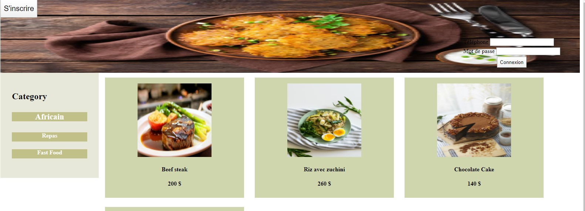
C'est sur cette page que le client a accès au contenu de la plateforme (il y retrouve les articles proposer par le restaurant). Une fois le client connecté, il a la possibilité d'ajouter des articles à son panier via le bouton ajouter au panier de l'article concerné

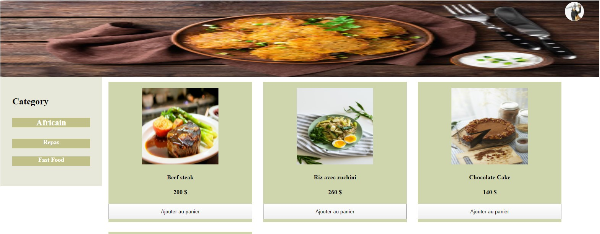
Il a ensuite la possibilité de retirer des articles et de passer commande ou annuler
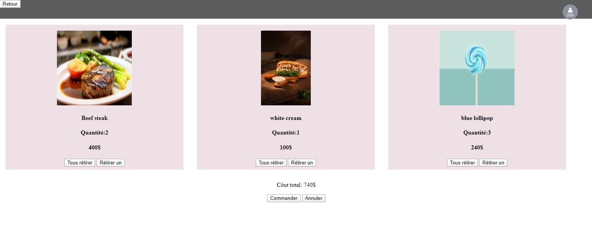
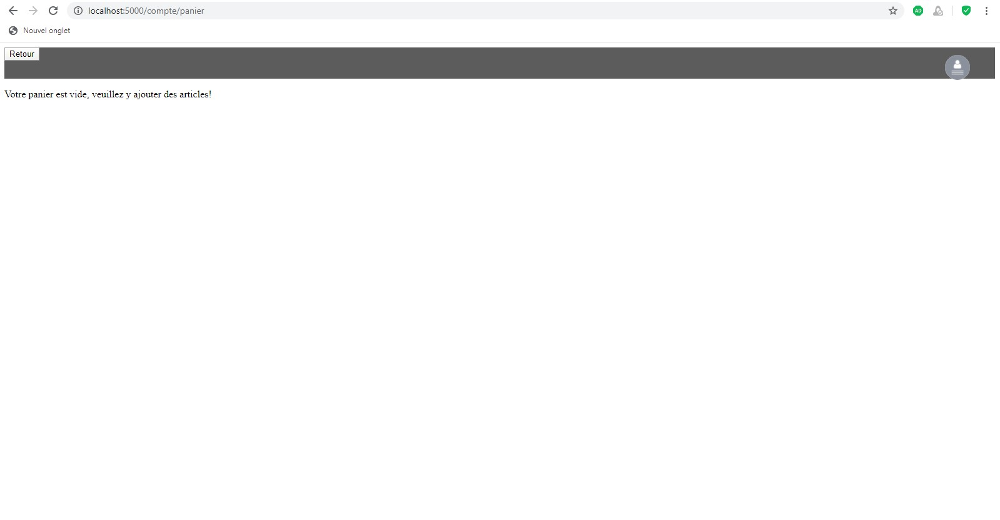

### Inscription
Cette page est accessible via l'URI <b>/compte/inscription</b>
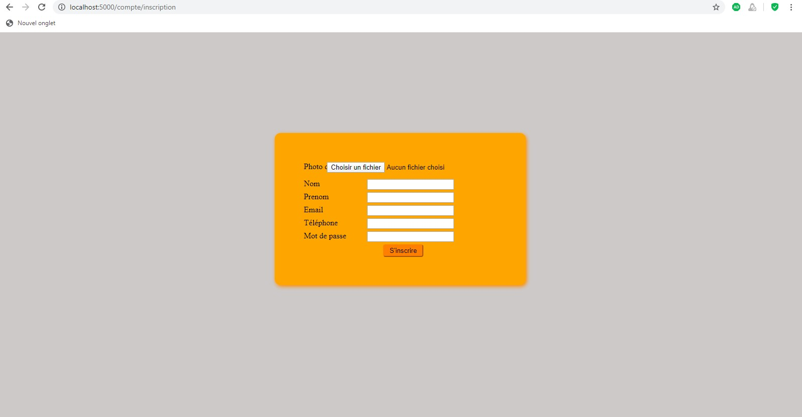
C'est à partir de cette page que les clients crée leur compte; pour cela il leur suffit de:
<ul>
<li>Choisir un photo</li>
<li>Entrer leur nom</li>
<li>Entrer leur prénom</li>
<li>Entrer leur numéro de téléphone (qui est considéré comme unique)</li>
<li>Entrer leur email</li>
<li>Choisir un mot de passe</li>
</ul>
Une fois les informations entrer, une presse sur le bouton s'inscrire créera leur compte.

### Connexion
Cette page sst accessible via les URI <b>/connexion/admin</b>, <b>/connexion/client</b>, <b>/connexion/caisse</b> pour chacune des entités.
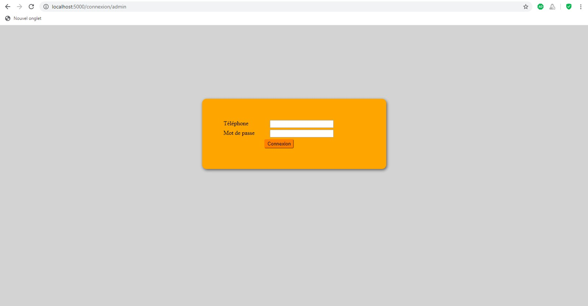
Pour se connecter, l'entité à juste besoin de son numéro de téléphone (unique) et de son mot de passe.
### Mon panier
Accessible via l'URI <b>/compte/panier</b>

C'est à cette page que le client retrouve tous les articles qui constituent sa commande actuelle. Pour chaque article, il voit la quantité prise ainsi que leprix du tout, il a la possibilité de retirer l'article à l'unité ou de tout retirer d'un coup via les boutons <b>Retirer un</b> et <b>Tous retirer</b>. Il a enfin le prix de la commande et la possibilité de la prendre ou la réfusé.
### Mes infos
Accessible via l'URI <b>/compte/infos</b>
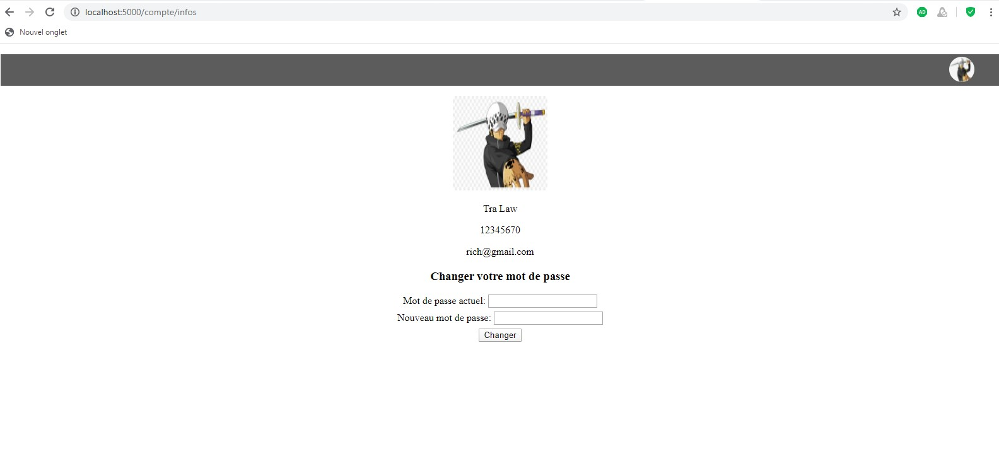
Cette page contient les informations concernant l'entité connectée et lui donne la possibilité de modifier son mot de passe.
### Admin
Accessible via l'URI <b>/admin</b>
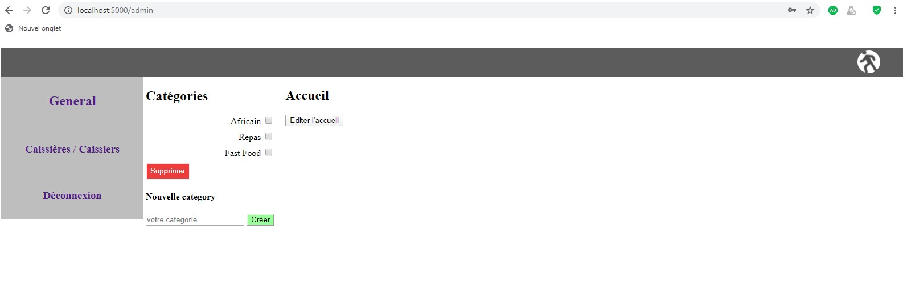
Elle est constitué de deux blocs principaux que sont <b>General</b> et <b>Caissières / Caissiers</b>. Dans le bloc general celui a la possibilité de créer des catégories ou d'en supprimer si existant et un bouton <b>Editer l'accueil</b> qui le mène à l'affichage suivant:
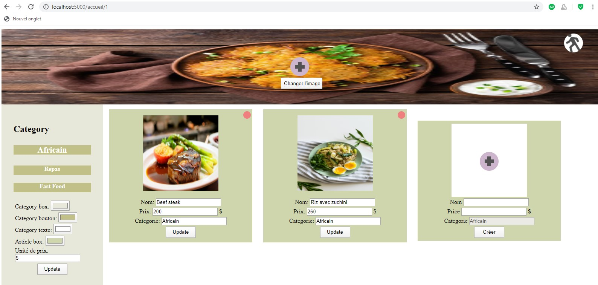
Ici il a la possibilité de créer, modifier ou supprimer des articles pour chaque catégorie, modifier les couleurs des différentes boites (référer vous à la video de présentation à partir de 4:20 pour plus de détails), changer l'image d'accueil ainsi que l'unité de prix des articles. 
Dans le bloc <b>Caissières / Caissiers</b>

L'admin a la possibilité de créer ou retirer un caissier, la création du caissier est identique à l'inscription d'un client.
### Caisse
Accessible via l'URI <b>/caisse</b>
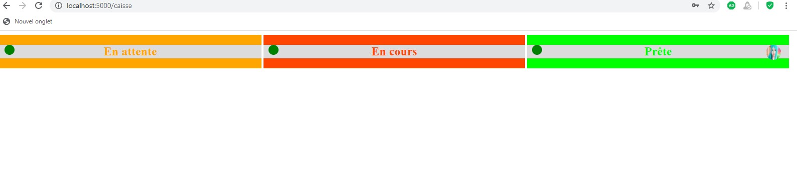
Elle est composée de trois parties que sont:
<ul>
<li>En attente: c'est la zone pour les nouvelles commandes</li>
<li>En Cours: c'est la zone pour les commandes en cours de traitement</li>
<li>Prête: c'est la zone pour les commandes prête àêtre lirée</li>
</ul>
Les commandes arrivent en temps réel chez celui-ci
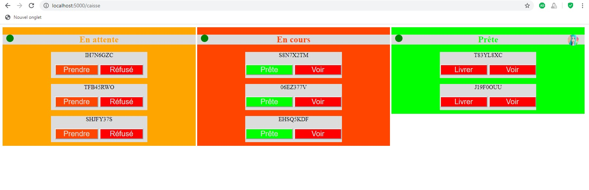
Il a égalemment la possibilité de désactiver le temps réel et ce pour chaque partie indépendemment, celui se fait à partir des boutons au dessus de chaque partie; le bouton est vert que le temps réel est activé et rouge dans le cas contraire
